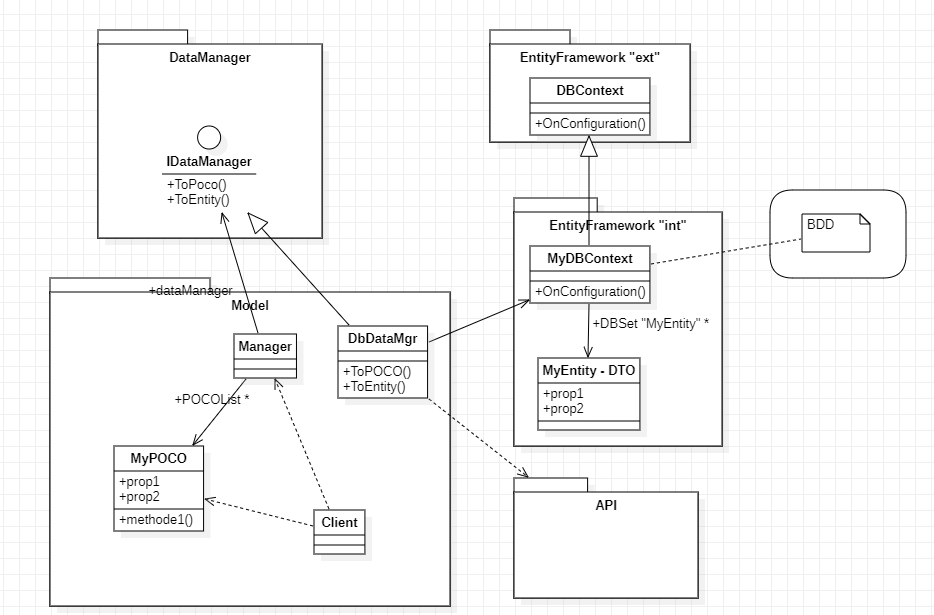

# Entity Framework

### Evaluation

##### Conception
Plusieurs clients mobiles, web et desktop et le model est le même pour tous fonctionnant en local et pouvant consommer une BDD (partie Entity Framework). Sur un côté distant on veux aller cherhcher ses données via une web API qui consomme lui aussi une bdd (Conso de Service).

Le client, la logique, le modèle et le stub sont fournis

### Objectif :
- Construction et consommation de la BDD avec EF core
- puis avec un client spécifique pour pouvoir dialoguer avec l'API
- Rajouter un couche d'abstraction( Stratégie ) pour que les consommations soit interchangeables.
- Gérer les bases, les tables et l'évolution
- Déployer l'application
- Rajouter de la qualité (tests)

### Exercice 

10 points :
- Ex 1: 1 BDD avec 1 table champion puis on l'utilise par le client avec des requêtes CRUD + du filtrage
- Ec 2 : test unitaires avec bdd stubé avec SQLiteinMemory pour tests
- Ex 3 : Déploiement et tests (code firsts) 

6 points :
- Ex 4 : Même chose avec rune et skins en 1 table (3 tables séparés)
- Ex 5 : Relation entre champion et skin (1 to many) ()
- Ex 6 : Relation entre chmapion page de rune et rune (2 fois many to many)

4 points :
- Ex 7 : Mapping entre modèles et entité (qualité) :
    - part 1: 1 tables (after 5)
    - part 2: relations (after 6)
- Ex 8 : Rajouter le pattern Unit of work ( permet de faire un rollback )

### Ressources 

> Cours : https://codefirst.iut.uca.fr/documentation/mchSamples_.NET/docusaurus/mchsamples-.net-core/docs/category/entity-framework-core/  
Exemples :
> - Relations : 2.10

# Fonctionnement

**EF core** : c'est un ORM (Object Relationnal Manager) : il créer les bases, les tables et s'occupe des requêtes.

Il va d'abord créer la base de donnée en utilisant une classe fille dérivée de DBContext et va redéfinir la méthode OnConfiguration().
> *On peut définir quel fournisseur (SGBD) on utilise (pas dans ce cours) dans la méthode. Cela permet d'utiliser les fonctionnalités spécifiques à un service.*

### 1ère Partie : 
**OnConfiguring** permet alors la création de la base : la classe fille possède une collection sous forme de **DBSet** de 
L'entité permet d'encapsuler des propriétés qui seront stockés dans des tables avec de nombreux automatismes (id) mais on peut rajouter des contraintes manuellement

### 2e partie : 
Le client utilise **DbContext** pour faire des requetes et obtenir des collections d'entité grâce à **LinqToEntity** 
> *LinqToEntity permet de faire des requetes sur des collections : where, take, select, selectMany, orderBy*  

Par Exemple :

        
    nounours.where(n=> n.nbPoils>500).orderBy(n=>n.id);

## ***Séparation du Model :*** 

On ne dépend alors plus de EntityFramework et on peut donc polluer "MyEntity" avec des annotations.

> **POCO** : **P**lain **O**ld **C**LR (**C**ommon **L**anguage **R**untime = .NET) **O**bject 

> **ATTENTION** : Les classes implementant IDisposable ne sont pas managé par le garbage collector, il faut donc utiliser .dispose() pour libérer l'espace manuellement.  