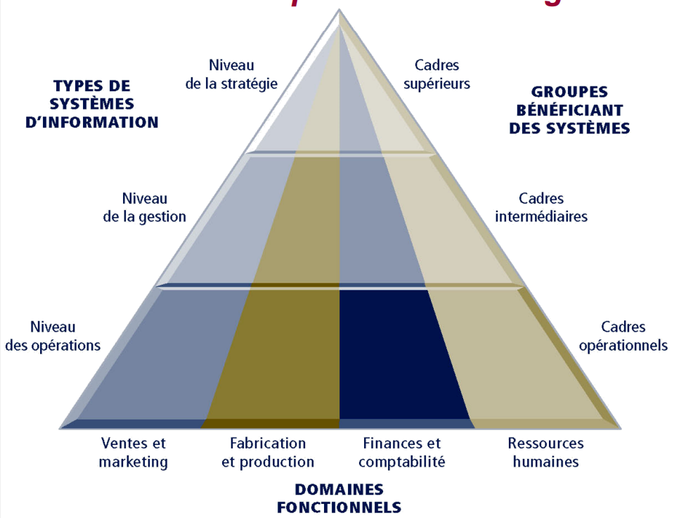

# Système d'information 

### Evaluation 

6h de TD / 4h de TP

# Présentation 

Exemple : Actes de naissance, Cadastres, ...

- **Collecter** l'information,
- **Répertorier** l'information,
- **Structurer** l'information,
- **Manipuler** l'information,
- **Analyser** l'information,
- **Diffuser/Échanger** l'information et gérer son accès

***Ce n'est pas qu'un système technique, mais aussi un ensemble de procédure pour collecter de l'information.***

Dans une entreprise les différentes activités sont : 
- **Soutien**
    - Infrastucture
    - Ressources Humaines
    - R & D
    - Achats
- **Base**
    - Approvisionnement
    - Fabrication
    - Logistique
    - Marketing et ventes
    - Services

# Les principaux types de systèmes :

- Opérationnels (SO) : Ils aident les équipes à assurer le fonctionnement des opération, des activité et des transactions récurrentes. Enregistre l'information 

- Gestions (SMO) : quels sont les objectifs et prévision des concurrents. Aide à la décision

- Stratégique (SIS) : Aide à répondre à des questions sur moyen, long terme (5/10 ans : investissement, stratégie)

**Il en ressort 4 principaux :**

- STT : Systèmes de traitement des transactions -> SO
- SIG : SI de gestion -> SMO
- S(I)AD : Système (interactif) d'aide à la décision -> SMO
- SID : SI pour dirigeant -> SIS

Plus le systèmes est haut dans les domaines, plus les données extérieurs sont requises.

Un système intégré : un sytème qui communique de bout en bout de l'entreprise et également avec l'extérieur, il est composé de différents processus, processus accessibles à toute l'entreprise. 